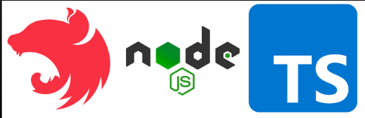

  

## 📌 Descrição

[Projeto Rosa](https://ifpi-projects.onrender.com/) é o primeiro laboratório da disciplina de Programação para Internet II. Tem por objetivo a criação de um Painel de um Produtos de Investimento Renda Fixa, página web com arquitetura MVC. 

## ⚙️ Ferramentas

* [Nest](https://nestjs.com/) - back-end

* [Handlebars](https://handlebarsjs.com/) - template engine

* [Node](https://nodejs.org/en) - gerenciador de pacotes

* Typescript - linguagem de desenvolvimento

## 📝 Estudos

* Playlist - [Curso de Node.js](https://www.youtube.com/watch?v=LLqq6FemMNQ&list=PLJ_KhUnlXUPtbtLwaxxUxHqvcNQndmI4B)

* Aula - [Padrão MVC (Model - View - Controller)](https://www.youtube.com/watch?v=mMDt9g7bMjk)

* Compartilhando descobertas - [Docker + Render: colocando seu site online](https://www.youtube.com/watch?v=W7Y7ThMGdXc&t=121s)
